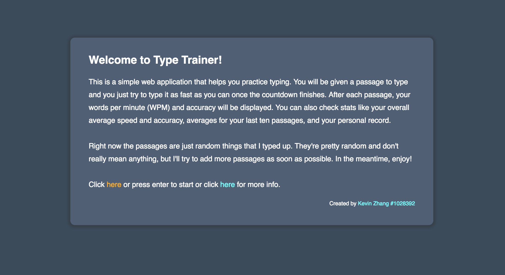

# Type Trainer

Type Trainer is an application that helps you practice typing. Statistics like words per minute (WPM) and accuracy are displayed after each passage. Click [here](./screenshots) for more screenshots.



To run this project locally:

```
git clone https://github.com/Kinzeng/type-trainer.git
cd type-trainer
npm install
npm start
```

Finally, visit [http://localhost:8080](http://localhost:8080).
